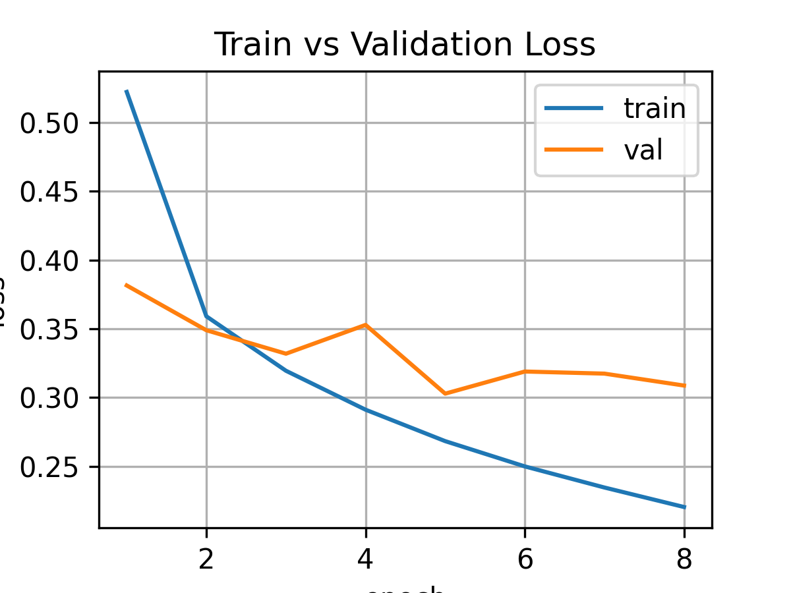
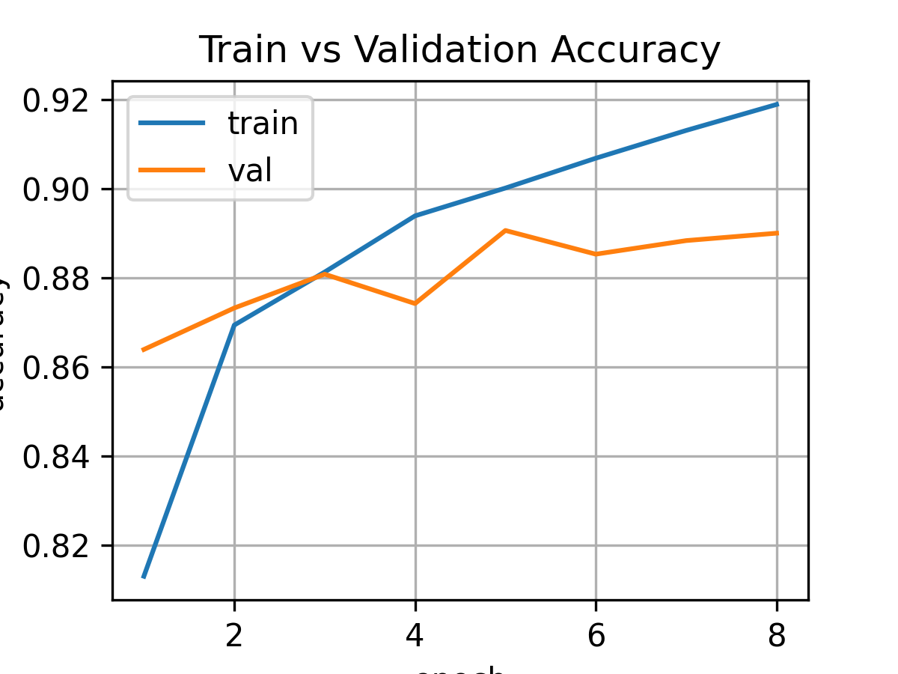

# FashionMNIST Classification using MLP (PyTorch)

A complete end‑to‑end **Deep Learning project** built using **PyTorch** to classify FashionMNIST images using a **Fully Connected Neural Network (MLP)**. This project includes:

* Data preprocessing (mean/std normalization)
* Custom train/validation/test split
* Early stopping
* Best model saving
* Full training loop (PyTorch‑style)
* Visualization of loss & accuracy curves
* Test set evaluation

---

## 📦 Project Structure

```
FashionMNIST-MLP/
│
├── data/                      # Downloaded raw/transformed dataset (auto-created)
├── model/                     # Saved best model
│   └── fashion_model.pth
├── src/
│   ├── dataset.py             # Data loading, transforms, splitting
│   ├── model.py               # FashionModel class (MLP)
│   ├── train.py               # Training loop + early stopping
│   ├── evaluate.py            # Model testing
│   └── visualize.py           # Plotting loss & accuracy curves
│
├── plots/                     # Saved training graphs
│   ├── loss_curve.png
│   └── accuracy_curve.png
│
├── main.py                    # Runs full training + evaluation pipeline
├── requirements.txt           # Dependencies
└── README.md                  # Project documentation
```

---

## 🧠 Project Description

This model classifies each 28×28 FashionMNIST image into one of the 10 clothing categories:

```
0 T-shirt/top
1 Trouser
2 Pullover
3 Dress
4 Coat
5 Sandal
6 Shirt
7 Sneaker
8 Bag
9 Ankle boot
```

The goal is to build a proper **Deep Learning pipeline** using PyTorch:

* Load & inspect dataset
* Normalize (mean/std) pixel values
* Create train/validation/test loaders
* Build an MLP model
* Implement training loop, validation loop, early stopping
* Save best model
* Test on unseen data
* Visualize training curves

---

## 🏗 Model Architecture

```
Input  : 784 (flattened 28x28)
Hidden : 512 → ReLU
Hidden : 256 → ReLU
Output : 10 (raw logits for softmax)
Loss   : CrossEntropyLoss
Optim  : SGD + Momentum (0.9)
```

---

## 🛠 Technologies Used

* PyTorch
* Torchvision
* Matplotlib
* Python 3.x

---


## ▶️ Run on Google Colab (Recommended)

If you don't have a GPU on your local machine, you can run the entire project on **Google Colab**.

### **Open in Colab**

[](https://colab.research.google.com/github/Har02sh/fashion-mnist-mlp-pytorch/blob/main/main.ipynb)

### **Run Using Git Clone**

Open a new Colab Notebook and run:

```bash
!git clone https://github.com/<your-username>/FashionMNIST-MLP.git
%cd FashionMNIST-MLP

!pip install -r requirements.txt

!python main.py
```

---

## 📥 Installation (Local System)

Clone repository:

```bash
git clone https://github.com/<your-username>/FashionMNIST-MLP.git
cd FashionMNIST-MLP
```

Install dependencies:

```bash
pip install -r requirements.txt
```

---

## ▶️ Run Training

```
python main.py
```

This will:

* Train model
* Apply early stopping
* Save best checkpoint
* Produce plots
* Evaluate on test set

---

## 📊 Results

| Metric                   | Value |
| ------------------------ | ----- |
| **Train Accuracy**       | 92%   |
| **Validation Accuracy**  | 89%   |
| **Test Accuracy**        | 88%   |
| **Best Validation Loss** | 0.30  |

### Loss Curve



### Accuracy Curve



---

## 🧪 Testing the Saved Model

You can load and test the saved model using:

```python
state_dict = torch.load('model/fashion_model.pth')
model.load_state_dict(state_dict)
model.to(device)
```

---

## 🚀 Key Features Demonstrated

✔ Proper normalization (mean/std)
✔ Custom train/val split
✔ Early stopping implementation
✔ Best model checkpoint saving
✔ GPU/CPU device handling
✔ Visualization of metrics
✔ Clean, modular, production‑style code

---

## 📄 License

MIT License

---
